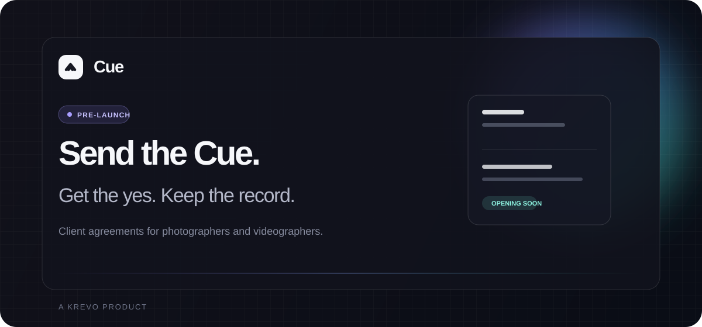

<p align="center">
  <a href="https://cue.krevo.io">
    
  </a>
</p>

<p align="center">
  <a href="https://cue.krevo.io"><strong>Visit Cue</strong></a>
  &nbsp;·&nbsp;
  <a href="./docs/solution.md"><strong>Read the product brief</strong></a>
  &nbsp;·&nbsp;
  <a href="./AGENTS.md"><strong>Engineering guide</strong></a>
</p>

<p align="center">
  
  
  
  
</p>

<br />

> **Cue is a pre-launch client-agreement product for photographers and videographers.**
> It helps creatives prepare, send, sign, and keep the record of their client agreements without the weight of a general-purpose business platform.

## What is live

| Surface | Status |
| --- | --- |
| Marketing site | Live on [cue.krevo.io](https://cue.krevo.io) |
| Waitlist | Live, validated, deduplicated, and rate-limited |
| Operator console | Private operations surface for waitlist and service health |
| Customer app (`/app`) | Built — accounts, six templates, the builder, sealed records |
| Client signing (`/s/[token]`) | Built — no account, consent gate, drawn signature, sealed audit trail |

The application landed on 2026-07-26 and is deployed: `/app`, `/s/[token]` and `/console` all serve on `cue.krevo.io`.

Cue still has no email delivery, server-side PDF rendering, object storage, or billing. A sealed record can be printed or saved through the browser. The public site distinguishes those working features from planned plan benefits.

## Run it locally

```bash
npm install
npm run dev
```

The landing page renders without services. The waitlist and private console need the server configuration described in [`.env.example`](./.env.example). Keep secrets out of the repository.

## The stack

```text
Next.js 16 + React 19 + TypeScript
PostgreSQL 17 + Redis 7 + Better Auth
Vercel
```

Deployed on Vercel. Postgres is Neon and the rate limiter is Upstash, both provisioned through the Vercel Marketplace and both in `us-east-1` alongside the functions.

## Quality gate

```bash
npm run lint
npx tsc --noEmit
npm test
npm run build
```

## Ship to production

```bash
npm run lint
npx tsc --noEmit
npm test
npm run build
git push origin main
```

A push to `main` deploys production through Vercel. There is no staging or rollback target. Apply reviewed migrations manually before code that depends on them, and push only a clean, focused, validated commit.

## Source of truth

- [`AGENTS.md`](./AGENTS.md) defines product boundaries, engineering conventions, and deployment safety.
- [`docs/`](./docs/README.md) holds the reference material: the [product brief](./docs/solution.md), [architecture](./docs/architecture.md), [security posture](./docs/security.md), [ideal customer](./docs/ideal-customer.md), and the internal [changelog](./docs/private-changelog.md).
- The application, migrations, and tests are authoritative for current behavior.

<p align="center">
  <sub>Built with focus by <a href="https://krevo.io">Krevo</a>.</sub>
</p>
