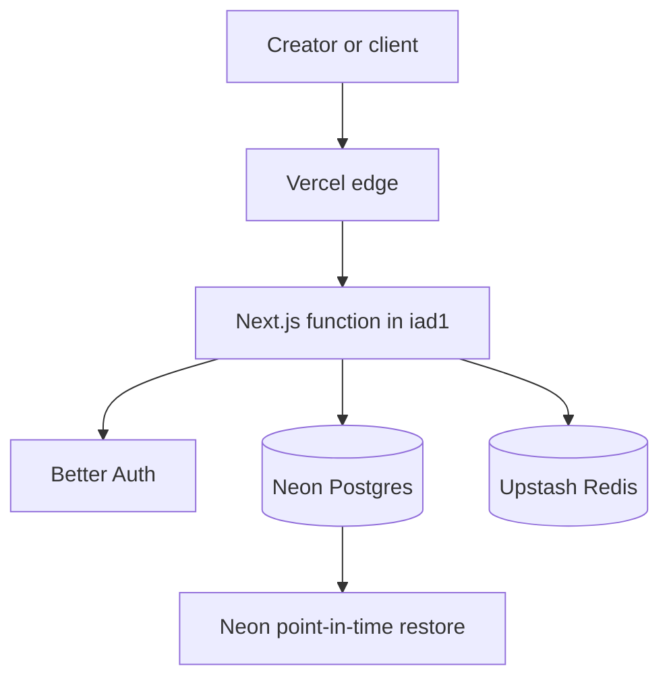

# Cue: Business, Marketing, and Technical Solution

## Executive summary

Cue is a client agreement and electronic-signing service built specifically for photographers and videographers. It helps a creator prepare a polished agreement, share a secure signing link, receive signatures, and retain a sealed, browser-printable record with audit events.

Cue is intentionally not a generic form builder, all-in-one studio-management platform, payment product, or invoicing tool. The focused promise is simple: **send the Cue, get the yes, keep the record.**

## Product definition

### Primary user

Independent photographers and videographers, beginning with wedding professionals. They need client-facing agreements regularly, often on mobile, and want a professional experience without the weight and cost of broad business software.

### Core user journey

1. A creator selects a template and personalizes the agreement.
2. Cue creates a secure, shareable signing link.
3. The client reviews the agreement, provides consent, and signs.
4. Cue freezes the completed agreement as an immutable snapshot.
5. Cue retains the sealed record and audit events. Today each party saves or prints a copy in the browser; server-generated PDFs and email delivery are planned.

### Product language

- **Company and app name:** Cue
- **The customer-facing object:** a Cue
- **Primary call to action:** Create your first Cue
- **Core line:** Send the Cue. Get the yes. Keep the record.

The Cue name requires a domain and trademark screen before the public launch.

## Marketing specification

### Positioning

For photographers and videographers who want professional agreements without heavyweight software, Cue makes it easy to create, send, sign, and store client agreements in minutes.

### Homepage copy

**Headline:** Send the Cue. Get the yes.

**Subhead:** Cue will create a polished client agreement, send a secure signing link, and keep the signed Cue in one place.

**Primary CTA:** Create your first Cue

**Supporting message:** From a template to a sealed record — built for the moments before a shoot.

**Closing CTA:** Send the Cue. Get the yes. Keep the record.

**Features section:** Everything essential. Nothing else.  
**Features lede:** Client agreements, considered. For photographers and videographers who prefer quiet confidence to busy software.  
**Features whisper:** Crafted for creatives · Effortless to send · Beautiful to sign  
**Features wells:** Distinctly yours · Sealed and settled · Always at hand

### Messaging pillars

1. **Made for creatives.** Cue is designed around the moments before a shoot, not enterprise document workflows.
2. **Fast to send.** Templates and saved details reduce repetitive setup.
3. **Professional for clients.** Every agreement feels branded, clear, and mobile-friendly.
4. **Reliable after signing.** Each completed Cue has a sealed document, a hash, and durable audit events.

### Initial go-to-market

Start with wedding photographers and videographers. Build excellent wedding-agreement templates and recruit 15 to 20 early users through direct outreach, creator communities, and short product demonstrations. The early goal is not broad reach; it is finding users who send agreements every month and will pay after the free allowance.

## Pricing and business model

| Plan | Price | Intended customer | Included value |
| --- | ---: | --- | --- |
| Free | $0 | Creatives evaluating Cue on real client work | Five total sent Cues, all current templates, browser-printable sealed records, audit events |
| Pro | $19/month planned | Independent photographers and videographers | Unlimited Cues today; saved templates and email reminders are planned |
| Studio | $49/month planned | Small creative businesses | Unlimited Cues today; multiple users, shared templates, custom domain, and priority support are planned |

The free allowance is five total sent Cues, not a monthly reset. That lets users experience genuine value while creating a clean conversion point when Cue becomes part of their workflow.

### Launch billing decision

Define the Free, Pro, and Studio plans in the product now, including feature gates and upgrade messaging, but **do not wire up Stripe for version one**. Launch the agreement product first, validate that creators repeatedly send Cues, and collect upgrade interest through a simple waitlist or contact flow. Add Stripe only after the core workflow has reliable usage and the pricing hypothesis is validated.

### Planning economics

These are operating assumptions, not a revenue forecast.

| Paid customers | Average monthly revenue per customer | Monthly recurring revenue | Estimated operating cost | Revenue before founder time and acquisition |
| ---: | ---: | ---: | ---: | ---: |
| 25 | $22 | $550 | $75 to $150 | $400 to $475 |
| 100 | $22 | $2,200 | $150 to $300 | $1,900 to $2,050 |
| 300 | $24 | $7,200 | $400 to $900 | $6,300 to $6,800 |

The main business risk is customer acquisition and retention, not hosting cost. Track sent Cues per active creator, free-to-paid conversion, monthly retention, and cost to acquire a paying customer.

## Technical architecture

### Current stack and planned services

- Next.js and TypeScript for the application and dashboard
- Better Auth for creator authentication and sessions
- PostgreSQL for users, templates, Cues, submissions, and audit events
- Upstash Redis for rate limiting only
- Planned: a background worker for PDF rendering and email reminders
- Planned: S3-compatible object storage for PDFs and uploads
- Planned: a transactional email provider for invitations, receipts, and reminders
- Required before broad access: error monitoring, uptime checks, and a tested restore procedure

### Hosting

Production runs on Vercel with Neon Postgres and Upstash Redis in `us-east-1`.
Functions are pinned to `iad1`. The application does not depend on proprietary
provider APIs, but there is no current staging or rollback environment.

### Current production topology

### Security and reliability requirements

- Enforce HTTPS and secure session cookies.
- Restrict database credentials to the minimum runtime privileges practical for Neon.
- Confirm Neon PITR retention and test restoration; add an independent encrypted copy before the risk justifies it.
- Store the frozen agreement, signer information, consent, timestamps, view events, and document hash as an immutable audit record.
- Rate-limit public signing endpoints and protect invite links with unguessable tokens.
- Use least-privilege credentials and keep operational secrets outside source control.

### Scaling path

Do not introduce Kubernetes or split services without measured pressure. Vercel
already scales the stateless application; the first likely additions are object
storage, transactional email, a worker, and observability. Keep agreement
integrity in Postgres transactions as those services arrive.

## Non-goals for version one

- Payment collection or invoicing
- Stripe billing integration during the initial product build
- Full CRM, lead management, or scheduling
- General-purpose form building
- Complex enterprise workflows
- Native mobile applications

Keeping these out of version one is a feature: Cue wins by making agreements feel fast, polished, and trustworthy for creative work.
