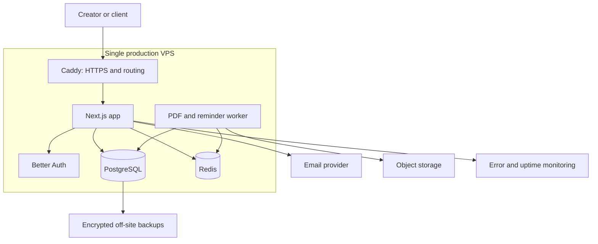

# Cue: Business, Marketing, and Technical Solution

## Executive summary

Cue is a client agreement and electronic-signing service built specifically for photographers and videographers. It helps a creator prepare a polished agreement, send a secure signing link, receive the completed record, and retain an auditable PDF.

Cue is intentionally not a generic form builder, all-in-one studio-management platform, payment product, or invoicing tool. The focused promise is simple: **send the Cue, get the yes, keep the record.**

## Product definition

### Primary user

Independent photographers and videographers, beginning with wedding professionals. They need client-facing agreements regularly, often on mobile, and want a professional experience without the weight and cost of broad business software.

### Core user journey

1. A creator selects a template and personalizes the agreement.
2. Cue creates a secure, shareable signing link.
3. The client reviews the agreement, provides consent, and signs.
4. Cue freezes the completed agreement as an immutable snapshot.
5. Cue generates a final PDF, retains the audit trail, and emails copies to both parties.

### Product language

- **Company and app name:** Cue
- **The customer-facing object:** a Cue
- **Primary call to action:** Create your first Cue
- **Core line:** Send the Cue. Get the yes. Keep the record.

The Cue name requires a domain and trademark screen before the public launch.

## Marketing specification

### Positioning

For photographers and videographers who want professional agreements without heavyweight software, Cue makes it easy to create, send, sign, and store client agreements in minutes.

### Homepage copy

**Headline:** Get the agreement out of the way.

**Subhead:** Create a polished client agreement, send a secure signing link, and keep the signed copy in one place.

**Primary CTA:** Create your first Cue

**Supporting message:** From inquiry to signed agreement, without the paperwork feeling like paperwork.

### Messaging pillars

1. **Made for creatives.** Cue is designed around the moments before a shoot, not enterprise document workflows.
2. **Fast to send.** Templates and saved details reduce repetitive setup.
3. **Professional for clients.** Every agreement feels branded, clear, and mobile-friendly.
4. **Reliable after signing.** Each completed Cue has a final PDF and a durable audit record.

### Initial go-to-market

Start with wedding photographers and videographers. Build excellent wedding-agreement templates and recruit 15 to 20 early users through direct outreach, creator communities, and short product demonstrations. The early goal is not broad reach; it is finding users who send agreements every month and will pay after the free allowance.

## Pricing and business model

| Plan | Price | Intended customer | Included value |
| --- | ---: | --- | --- |
| Free | $0 | Creatives evaluating Cue on real client work | Five total sent Cues, standard templates, final PDFs, audit trail |
| Creator | $19/month | Independent photographers and videographers | Unlimited Cues, custom branding, saved templates, email reminders, searchable agreement library |
| Studio | $49/month | Small creative businesses | Everything in Creator, multiple users, shared templates, custom domain, priority support |

The free allowance is five total sent Cues, not a monthly reset. That lets users experience genuine value while creating a clean conversion point when Cue becomes part of their workflow.

### Launch billing decision

Define the Free, Creator, and Studio plans in the product now, including feature gates and upgrade messaging, but **do not wire up Stripe for version one**. Launch the agreement product first, validate that creators repeatedly send Cues, and collect upgrade interest through a simple waitlist or contact flow. Add Stripe only after the core workflow has reliable usage and the pricing hypothesis is validated.

### Planning economics

These are operating assumptions, not a revenue forecast.

| Paid customers | Average monthly revenue per customer | Monthly recurring revenue | Estimated operating cost | Revenue before founder time and acquisition |
| ---: | ---: | ---: | ---: | ---: |
| 25 | $22 | $550 | $75 to $150 | $400 to $475 |
| 100 | $22 | $2,200 | $150 to $300 | $1,900 to $2,050 |
| 300 | $24 | $7,200 | $400 to $900 | $6,300 to $6,800 |

The main business risk is customer acquisition and retention, not hosting cost. Track sent Cues per active creator, free-to-paid conversion, monthly retention, and cost to acquire a paying customer.

## Technical architecture

### Recommended launch stack

- Next.js and TypeScript for the application and dashboard
- Better Auth for creator authentication and sessions
- PostgreSQL for users, templates, Cues, submissions, and audit events
- Redis for background-job queues and rate limiting
- A background worker for PDF rendering and email reminders
- S3-compatible object storage for PDFs and uploads
- A transactional email provider for invitations, receipts, and reminders
- Error monitoring and uptime checks

### Hosting recommendation

Launch on a single DigitalOcean VPS with Docker Compose. Start with a 4 GB RAM, 2 vCPU machine. It is sufficient for an early application with PostgreSQL, the web service, Redis, and a modest background worker while remaining easy to understand and operate.

Run Caddy in front of the app for HTTPS, routing, and basic rate limiting. Keep PostgreSQL private to the server. Store PDFs and uploads in object storage, not on the VPS disk.

### Production topology

### Security and reliability requirements

- Enforce HTTPS and secure session cookies.
- Put the database behind the application network; do not expose it publicly.
- Maintain nightly encrypted off-site database backups and test restoration regularly.
- Store the final rendered agreement, signer information, consent, timestamps, delivery events, and a document hash as an immutable audit record.
- Rate-limit public signing endpoints and protect invite links with unguessable tokens.
- Use least-privilege credentials and keep operational secrets outside source control.

### Scaling path

Do not begin with Kubernetes or multiple application servers. Once customer usage proves the need, move PostgreSQL to a managed service or dedicated database host first. Then add a second application instance and separate worker capacity. Object storage, email, and monitoring remain external from the beginning, so they do not need a disruptive migration.

## Non-goals for version one

- Payment collection or invoicing
- Stripe billing integration during the initial product build
- Full CRM, lead management, or scheduling
- General-purpose form building
- Complex enterprise workflows
- Native mobile applications

Keeping these out of version one is a feature: Cue wins by making agreements feel fast, polished, and trustworthy for creative work.
